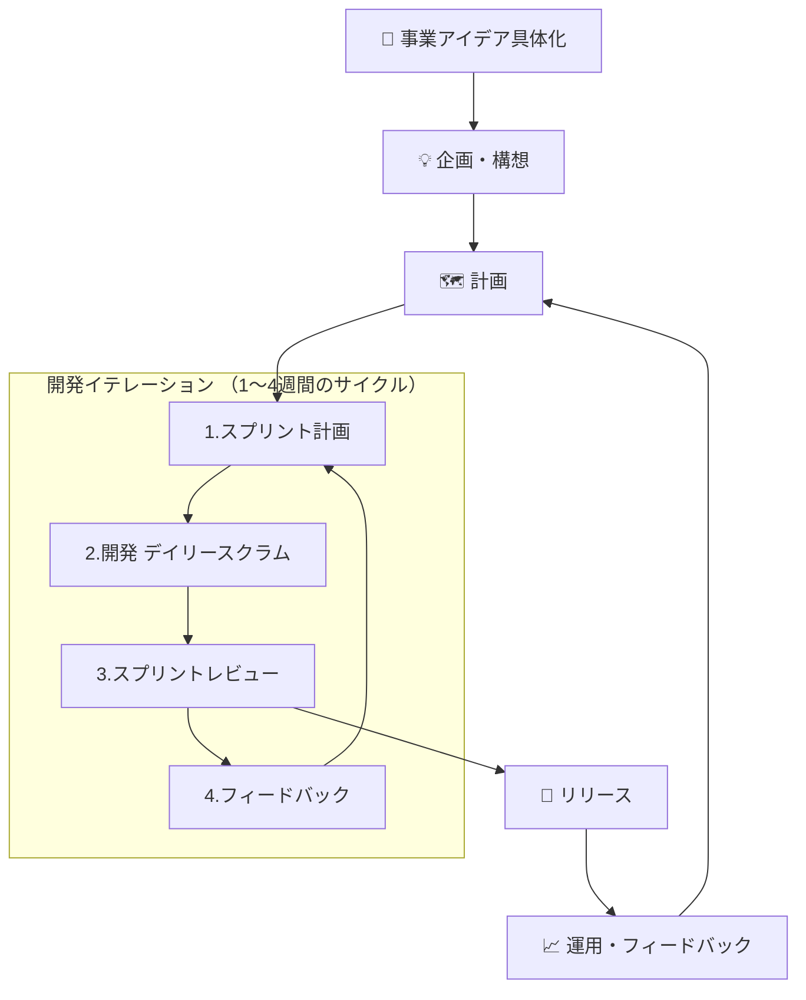

-----

### ## 各ステップの解説

フローチャートの各ステップで作成される、主なドキュメントや成果物（アウトプット）を見ていきましょう。これらを活用することで、チームの認識を揃え、プロジェクトを円滑に進めることができます。

### **ステップ0：事業アイデアの具体化とシステム境界の定義 🎯**

これは、アジャイル開発のイテレーションを回し始める前に、「そもそも、どんなビジネスを、どんなシステムで作るのか？」という土台を固めるための準備フェーズです。

* **インプット (Input):**
    * ビジネスアイデア、解決したい課題に関する漠然とした仮説

* **アウトプット (Output):**
    * **リーンキャンバス (Lean Canvas):**
        事業の核となる仮説（顧客、課題、解決策、収益など）を一枚にまとめたビジネスモデルの設計図。
    * **マーケティングリサーチレポート:**
        リーンキャンバスの仮説を裏付ける、市場規模や顧客ニーズに関する客観的なデータ。
    * **競合分析資料:**
        市場における競合の動向と、自社プロダクトの独自の価値や立ち位置を明確にした資料。
    * **システムコンテキスト図 (System Context Diagram):**
        開発対象のシステムと、それに関わる外部のユーザー（アクター）やシステムとの関係性を定義した、最初の技術設計図。

-----

### **ステップ1：企画・構想 (Discovery & Envisioning) 💡**

プロジェクトの全体像と目的を定義し、チーム内外の関係者と目線を合わせる段階です。

* **インプット (Input):**
    * リーンキャンバス、マーケティングリサーチレポート
    * 競合分析資料
    * システムコンテキスト図

* **アウトプット (Output):**
    * **インセプションデッキ (Inception Deck):**
        プロジェクトの「なぜ」「何を」「どのように」を10個の質問に答える形式でまとめたドキュメント。チームのキックオフで共通認識を醸成するために使われます。
    * **プロダクトビジョン・ステートメント (Product Vision Statement):**
        プロダクトが目指す姿や提供価値を簡潔にまとめた宣言文です。
    * **ペルソナ (Persona):**
        プロダクトの典型的なユーザー像を具体的に記述したドキュメント。開発チームが「誰のために作るのか」を常に意識するのに役立ちます。
    * **ユーザーストーリーマップ (User Story Map):**
        ユーザーの体験（ジャーニー）を時間軸に沿って描き出し、それに必要な機能（ユーザーストーリー）をマッピングしたものです。プロダクトの全体像を俯瞰できます。

-----

### **ステップ2：計画 (Planning) 🗺️**

開発対象となる機能や要件を具体化し、優先順位をつけます。

* **インプット (Input):**
    * インセプションデッキ
    * プロダクトビジョン・ステートメント
    * ユーザーストーリーマップ

* **アウトプット (Output):**
    * **プロダクトバックログ (Product Backlog):**
        開発すべき項目（アイテム）を優先順位順に並べたリストです。各アイテムは、ユーザーにとっての価値がわかる「**ユーザーストーリー**」形式（例：「〇〇として、△△ができるようになりたい。なぜなら□□だからだ」）で記述されることが多いです。
    * **プロダクトロードマップ (Product Roadmap):**
        数ヶ月から1年といった中長期的な視点で、いつ頃にどのような大きな機能をリリースしていくかを示した計画図です。

-----

### **ステップ3：開発イテレーション (Iteration / Sprint) 🔁**

実際にソフトウェアを開発する短いサイクルです。進捗の可視化やチーム改善のためのドキュメントが活用されます。

* **インプット (Input):**
    * プロダクトバックログ
    * （チームの過去の実績データとしての）ベロシティ
    * 前回のスプリントで作成された「インクリメント」

* **アウトプット (Output):**
    * **スプリントゴール (Sprint Goal):**
        今回のスプリントで達成すべき目標を簡潔に記述したもの。
    * **スプリントバックログ (Sprint Backlog):**
        スプリントで実施するタスクをプロダクトバックログから抜き出し、より詳細に分解したリスト。
    * **バーンダウンチャート (Burndown Chart):**
        スプリント期間中の残り作業量を日々プロットしたグラフ。計画通りに進んでいるかを視覚的に把握できます。
    * **インクリメント (Increment):**
        スプリントの成果物である「**動くソフトウェア**」。これはドキュメントではありませんが、最も重要なアウトプットです。
    * **KPTなどのふりかえり議事録:**
        スプリントレトロスペクティブ（ふりかえり会）で出た、チームのKeep（継続すること）、Problem（問題点）、Try（次に試すこと）を記録したものです。

-----

### **ステップ4：リリース (Release) 🚀**

完成した機能をユーザーに届けます。

* **インプット (Input):**
    * リリース可能と判断されたインクリメント（群）
    * テスト仕様書、テストレポート

* **アウトプット (Output):**
    * **リリースノート (Release Notes):**
        ユーザーや関係者に向けて、今回のリリースで追加・変更された機能や修正点をまとめたドキュメントです。
    * **デプロイ手順書 (Deployment Plan):**
        本番環境へ安全にデプロイするための手順を記したドキュメント（自動化されている場合は不要なことも多いです）。

-----

### **ステップ5：運用・フィードバック (Operate & Feedback) 📈**

ユーザーからの反応を収集し、次の改善に繋げます。

* **インプット (Input):**
    * 本番稼働中のプロダクト
    * ユーザーからの問い合わせメールやチャットログ
    * App Store / Google Playなどのレビュー

* **アウトプット (Output):**
    * **アクセス解析レポート:**
        Google Analyticsなどのツールから出力される、ユーザーの行動に関する定量的データ。
    * **VOCレポート (Voice of Customer):**
        カスタマーサポートなどに寄せられた「顧客の声」を分析・分類してまとめた報告書。
    * **障害報告書 (Incident Report):**
        発生したシステム障害について、原因、影響範囲、暫定対応、恒久対策などをまとめたドキュメント。
    * **（結果として）更新されたプロダクトバックログ:**
        これらのレポートやデータから得られた知見は、新たなユーザーストーリーとしてプロダクトバックログに追加・更新されます。